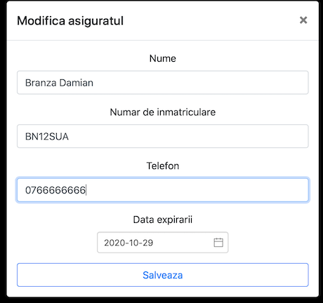

# Insurancer
A web application for insurance agents where they can store information about clients' insurance policies. 

It's important for an insurer to have loyal clients, so he will get an email each day with insurances that are about to expire next week. This way he can call his clients and remind them of the expiring contract.

The user can either upload a PDF file with the insurance and the fields will be completed based on the information found in that file, or type the data for each field.

The list of all insurances is also displayed, each one supporting modification of the saved data or its removal.

When an insurance is about to be edited, a modal pops out and asks the user to edit the existing data.

Currently, the entered data is stored in a MySQL database, on an EC2 instance. The server is kept up and running via [pm2](https://pm2.keymetrics.io) and mails are sent with the help of [nodemailer](https://nodemailer.com/usage/).

